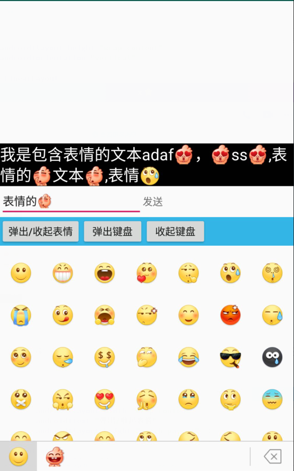

keyboard
---


使用方法
---
1. 添加依赖
```
repositories {
    maven { url "https://dl.bintray.com/ingxin/maven" }
}

dependencies {
  //解析表情（必须）
  implementation ''com.xingxin.android:emoticons:1.1.3'
  //表情键盘UI(必须)
  implementation 'com.xingxin.android:keyboard:1.1.3'
  //小浪花表情库(非必须)
  implementation ''com.xingxin.android:emoticons_xlh:1.0.0'
  //默认表情库(非必须)
  implementation 'com.xingxin.android:emoticions_default:1.0.0'
}

```

2. 添加布局文件
```xml
<cn.ingxin.chatkeyboard.lib.view.SoftHandleLayout 
    android:layout_width="match_parent"
    android:layout_height="match_parent">

    <!--面板-->
    <LinearLayout
        android:layout_width="match_parent"
        android:layout_height="wrap_content"
        android:layout_alignParentBottom="true"
        android:orientation="vertical">

        <!--你的布局，输入框表、发送按钮、情按钮等布局-->
        <!--将EdiTText替换成KEditText-->

        <!--表情容器-->
        <FrameLayout
            android:id="@+id/ckb_face_container"
            android:layout_width="match_parent"
            android:layout_height="0dp"
            android:layout_gravity="bottom"
            android:orientation="vertical" />

    </LinearLayout>

    <!--ViewGroup,输入框上方的正常布局-->
    
</cn.ingxin.chatkeyboard.lib.view.SoftHandleLayout>
```

3. Activity添加属性
```xml
android:windowSoftInputMode="adjustResize"
```

4. 初始化
```java
//find 表情容器
faceContainer = (ViewGroup) findViewById(R.id.ckb_face_container);

//初始化表情解析器
xEmoticon = new XEmoticon.Builder()
             //将表情解析工厂方法添加到解析器中
            .addResolverFactory(XlhResolverFactory.create())
            .addResolverFactory(DefResolverFactory.create())
            .build();
            
//通过你自己的方法加载获取表情
ArrayList<Emoticon> emoticons = DefEmoticonUtils.getEmoticonList();
ArrayList<Emoticon> emoticons2 = XlhEmoticonUtils.getEmoticonList();

//第一页的表情
PageSet pageSet = new PageSet.Builder()
            //设置这一页表情列数
            .setColumn(7)
            .setEmoticons(emoticons)
            //表情icon
            .setIcon(R.mipmap.d_weixiao)
            .build();

//第二页表情
PageSet pageSet2 = new PageSet.Builder()
           .setColumn(7)
           .setEmoticons(emoticons2)
           .setIcon(R.mipmap.lxh_xiaohaha)
           .build();

//创建表情管理
mKb = new Kb.Builder(this)
        .addPageSet(pageSet)
        .addPageSet(pageSet2)
        .setOnEmoticonClickListener(new OnEmoticonClickListener() {
            @Override
            public void onEmoticonClick(Emoticon item, int position, int page) {
                //表情点击事件   
                xEmoticon.insert2View(etInput, item);
            }

            @Override
            public void onOperation(String operationName) {
                //其他功能按键事件
                if (EmoticonPageFragment.DELETE.equals(operationName)) {
                    XEmoticon.deleteEvent(etInput);
                }
            }
        })
        .with(faceContainer)
        //自定义表情展示容器
       //.setCustomFragment(EmoticonPageFragment.newInstance())
        .build();

//处理返回事件
@Override
public void onBackPressed() {
   if (!mKb.onBackPressed()) {
       super.onBackPressed();
   }
}

```
自定义表情
---
1. 将你自己的表情封装成Emoticon
2. 实现你自己的表情解析工厂
```java
public class YourResolverFactory implements ResolverFactory {
//见方法注释
}
xEmoticon = new XEmoticon.Builder()
             //将你的表情解析增加到解析器中
            .addResolverFactory(YourResolverFactory.create())
            .build();

ArrayList<Emoticon> emoticons = 你的方法;
```
3. 正常初始即可

常用API
---
##### 表情面板
1. kb.setCustomFragment(你自己的XEmoticonPageFragment )：设置自己的表情容器
2. kb.showKb：显示表情面板
3. kb.hideKb：隐藏表情面板
4. kb.openSoftKeyboard/kb.closeSoftKeyboard：打开/收起输入法软键盘
5. kb.getKbState：获取当前表情面板状态
6. kb.showOther：将其他Fragment显示到表情面板
7. kb.showEmoticion：当调用了showOther需要调用显示回来

##### 表情解析
1. xEmoticon.displayEmoticon(tv, content)：显示带表情文本的内容
2. xEmoticon.parserContent：解析表情文本，并返回CharSequence
3. xEmoticon.deleteEvent：模拟一次删除事件

TODO
---
- [ ] 添加网络表情加载

